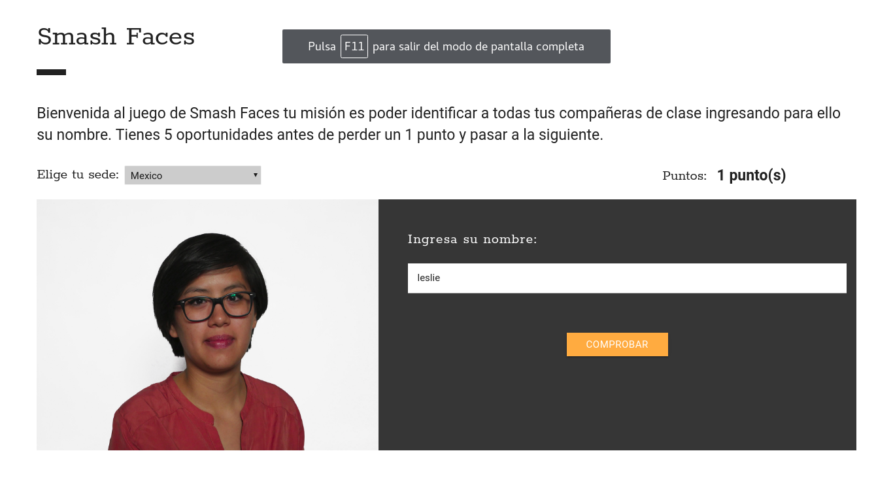

# S41-SmashFaces

SmashFaces es un juego que ayuda a las estudiantes de un mismo salòn a que se conozcan, el juego consiste en adivinar el ombre de la estudiante segun su foto.

Para la prueba se utilizo el nombre de "Leslie" de la sede Mexico.

El jego marca la puntuacion de los aciertos.

